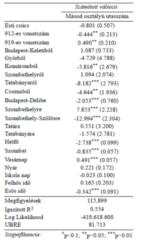
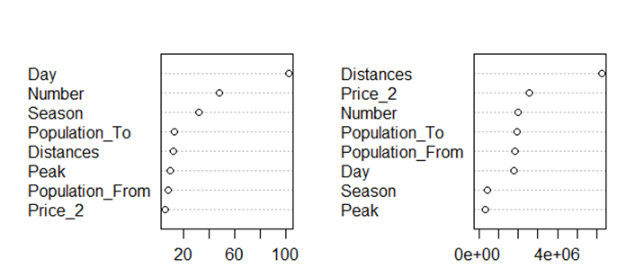
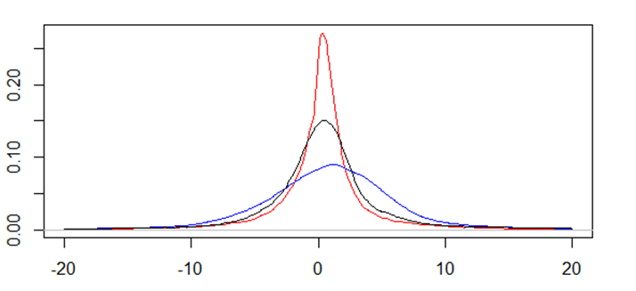
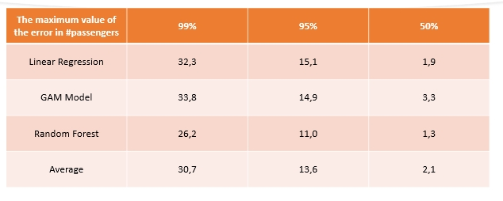

# Demand-model-for-the-hungarian-passenger-rail-company

## Table of Content
- [Introduction](#Introduction)
- [Data and data cleaning](#Data-and-data-cleaning)
- [Models](#Models)
- [Result](#Result)
- [Options for improvment](#Options-for-improvment)
- [Bibliography](#Bibliography)

### Introduction

The aim of this study and my bachelore thesis was to prove that it is possible to create a demand forecasting model to the Hungarain passenger railway operator (MÁV-START Zrt.). During my study I get the exact number of passenger from the year of 2019 according to every OD pairs. I also get that information with the data how many passengers were in the 1st and the 2nd class. Nowadays most of the railway operators have some kind of model in the european market. Such as the PDFH in Great Brittain and the Aurora in Netherland. A good demand forecasting model can help the company to improve the service which is provided. They can optimize the number of train to avoid over and undercrowding.

### Data and data cleaning

The data was far from optimal when I get it to analyse. The data was to processed and I had to first convert it back to raw data. After that I add more new explanatory variables to build better models. I added variables about the weather conditions, the rush hour, the population, the national days and the timetable data.

### Models

First I tried to build a model for the whole network but at a early stage I realized that according to the most recent litterature that I should use just the little part of the data. At the end  I chose the 100a line from the hungarian rail lines. I created three different models at the end to try to find the best fitting model. I created a Generalized Linear Model, a GAM (Generalized Additive Model) and a Random Forest model. During the GLM model I take account the interaction between the variables also to get the best response.

The result of the models:

Map of the Hungarian Rail lines:

### Result

At the end the best fiting model was the Random Forest model. It has very high explanation power the R^2 value of this model was more than 70%.

The distribution of the difference between the predicted and the original value. Linear Regression (black), Random Forest (red), GAM Model (blue):

The same difference but with other confidence interval:

### Options for improvment

It would be a good help if I get at least three following years instead of just one year to show the model the yearly repeating events. It would be also better if I used more model validation. And the result can be made better with data about how mjuch does it take in hour to get the same OD pair where I know the duration by train.

### Bibliography

Anvari, S., Tuna, S., Canci, M., Turkay, M., 2016. Automated Box-Jenkins forecasting tool with an application for passenger demand in urban rail systems: Automated Forecasting Method. J. Adv. Transp. 50, 25–49. https://doi.org/10.1002/atr.1332

Blainey, S., 2010. Trip end models of local rail demand in England and Wales. Journal of Transport Geography 18, 153–165. https://doi.org/10.1016/j.jtrangeo.2008.11.002

Börjesson, M., 2014. Forecasting demand for high speed rail. Transportation Research Part A: Policy and Practice 70, 81–92. https://doi.org/10.1016/j.tra.2014.10.010

Brems, C., Jensen, T., 2010. Long term changes in transport demand. Presented at the European Transport Conference, 2010Association for European Transport (AET), Citeseer.

Bulman, E., Hanif, A., Sauvant, A., 2010. Modelling Demand by Time of Day for High Speed Rail Services in France. Presented at the European Transport Conference, 2010Association for European Transport (AET), Citeseer.

Crockett, J., Mason, A., Segal, J., Whelan, G., Condry, B., 2010. UK regional rail demand in Britain. Presented at the European Transport Conference, 2010Association for European Transport (AET).

Cyprich, O., Konečný, V., Kiliánová, K., 2013. Short-Term Passenger Demand Forecasting Using Univariate Time Series Theory. PROMET 25, 533–541. https://doi.org/10.7307/ptt.v25i6.338

Hänseler, F.S., van den Heuvel, J.P.A., Cats, O., Daamen, W., Hoogendoorn, S.P., 2020. A passenger-pedestrian model to assess platform and train usage from automated data. Transportation Research Part A: Policy and Practice 132, 948–968. https://doi.org/10.1016/j.tra.2019.12.032

James, G., Witten, D., Hastie, T., Tibshirani, R. (Eds.), 2013. An introduction to statistical learning: with applications in R, Springer texts in statistics. Springer, New York.

Jones, I.S., Nichols, A.J., 1983. The Demand for Inter-City Rail Travel in the United Kingdom: Some Evidence. Journal of Transport Economics and Policy 17, 133–153.

Lythgoe, W.F., Wardman, M., 2004. Modelling passenger demand for parkway rail stations. Transportation 31, 125–151. https://doi.org/10.1023/B:PORT.0000016468.14434.24

Lythgoe, W.F., Wardman, M., 2002. Demand for rail travel to and from airports. Transportation 29, 125–143. https://doi.org/10.1023/A:1014298902528

Marks, P., Gerrits, L., 2017. Evaluating technological progress in public policies: the case of the high-speed railways in the Netherlands. CGN 48. https://doi.org/10.20377/cgn-42

McGeehan, H., 1984. Forecasting the Demand for Inter-Urban Railway Travel in the Republic of Ireland. Journal of Transport Economics and Policy 18, 275–291.

Preston, J., 1991. Demand Forecasting for New Local Rail Stations and Services. Journal of Transport Economics and Policy 25, 183–202.

Preston, J., Robins, D., 2013. Evaluating the long term impacts of transport policy: The case of passenger rail privatisation. Research in Transportation Economics 39, 14–20. https://doi.org/10.1016/j.retrec.2012.05.019

van den Heuvel, J.P.A., Hoogenraad, J.H., 2014. Monitoring the Performance of the Pedestrian Transfer Function of Train Stations Using Automatic Fare Collection Data. Transportation Research Procedia 2, 642–650. https://doi.org/10.1016/j.trpro.2014.09.107

Wardman, M., 2006. Demand for rail travel and the effects of external factors. Transportation Research Part E: Logistics and Transportation Review 42, 129–148. https://doi.org/10.1016/j.tre.2004.07.003

Wardman, M., Lythgoe, W., Whelan, G., 2007. Rail Passenger Demand Forecasting: Cross-Sectional Models Revisited. Research in Transportation Economics 20, 119–152. https://doi.org/10.1016/S0739-8859(07)20005-8
