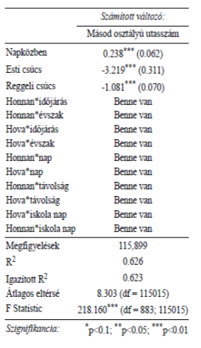

# Demand-model-for-the-hungarian-passenger-rail-company

## Table of Content
- [Introduction](#Introduction)
- [Data and data cleaning](#Data-and-data-cleaning)
- [Models](#Models)
- [Result](#Result)
- [Options for improvment](#Options-for-improvment)

### Introduction

The aim of this study and my bachelore thesis was to prove that it is possible to create a demand forecasting model to the Hungarain passenger railway operator (MÁV-START Zrt.). During my study I get the exact number of passenger from the year of 2019 according to every OD pairs. I also get that information with the data how many passengers were in the 1st and the 2nd class. Nowadays most of the railway operators have some kind of model in the european market. Such as the PDFH in Great Brittain and the Aurora in Netherland. A good demand forecasting model can help the company to improve the service which is provided. They can optimize the number of train to avoid over and undercrowding.

### Data and data cleaning

The data was far from optimal when I get it to analyse. The data was to processed and I had to first convert it back to raw data. After that I add more new explanatory variables to build better models. I added variables about the weather conditions, the rush hour, the population, the national days and the timetable data.

### Models

First I tried to build a model for the whole network but at a early stage I realized that according to the most recent litterature that I should use just the little part of the data. At the end  I chose the 100a line from the hungarian rail lines. I created three different models at the end to try to find the best fitting model. I created a Generalized Linear Model, a GAM (Generalized Additive Model) and a Random Forest model. During the GLM model I take account the interaction between the variables also to get the best response.

### Result

At the end the best fiting model was the Random Forest model. It has very high explanation power the R^2 value of this model was more than 70%.

